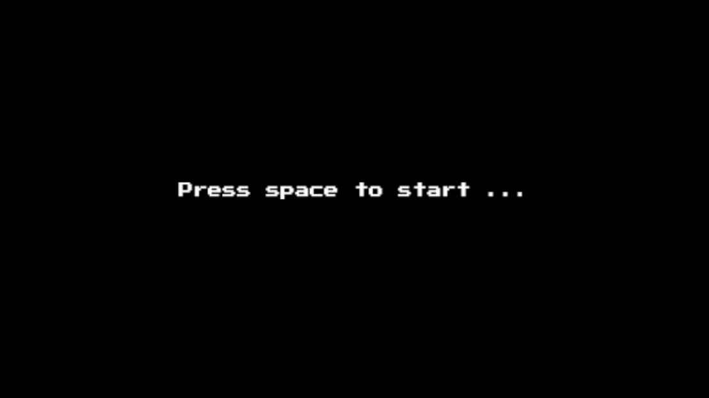
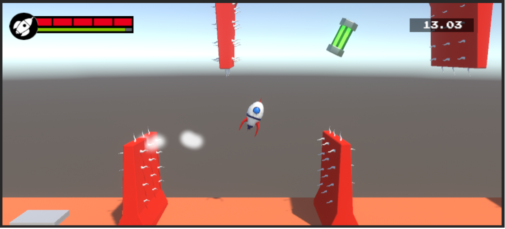
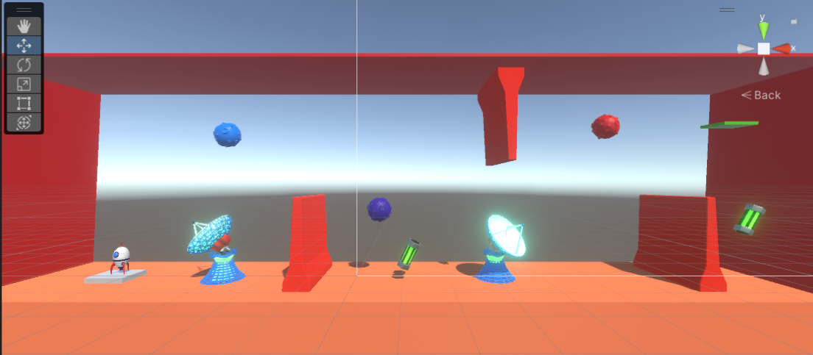
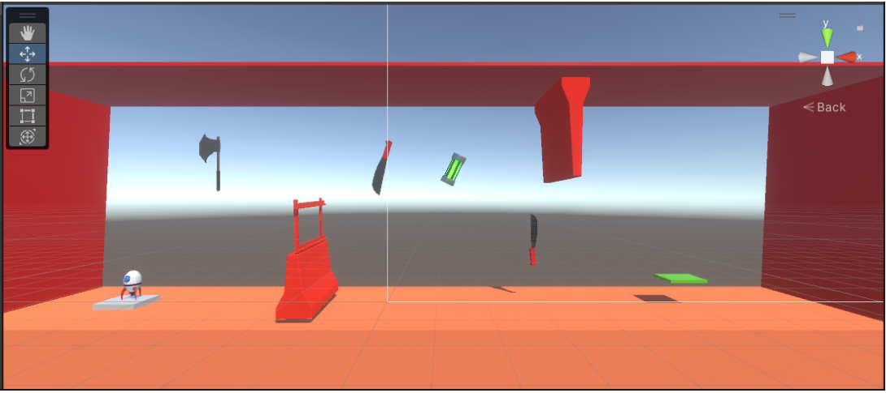
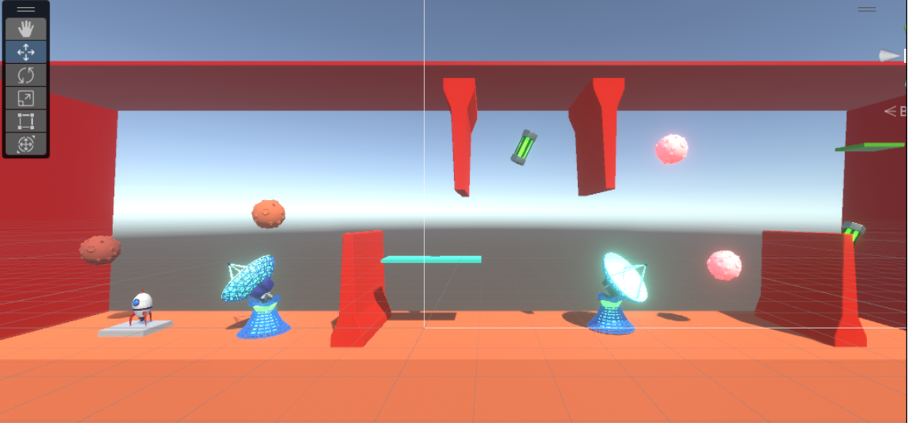
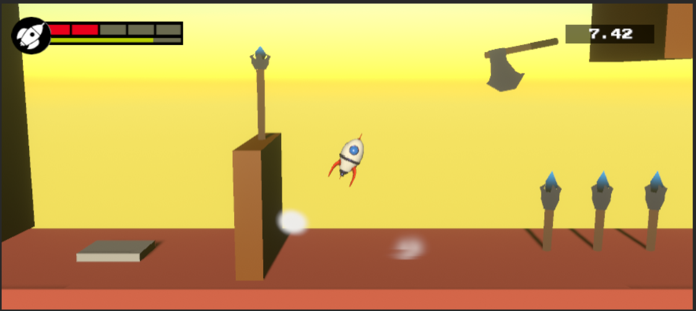
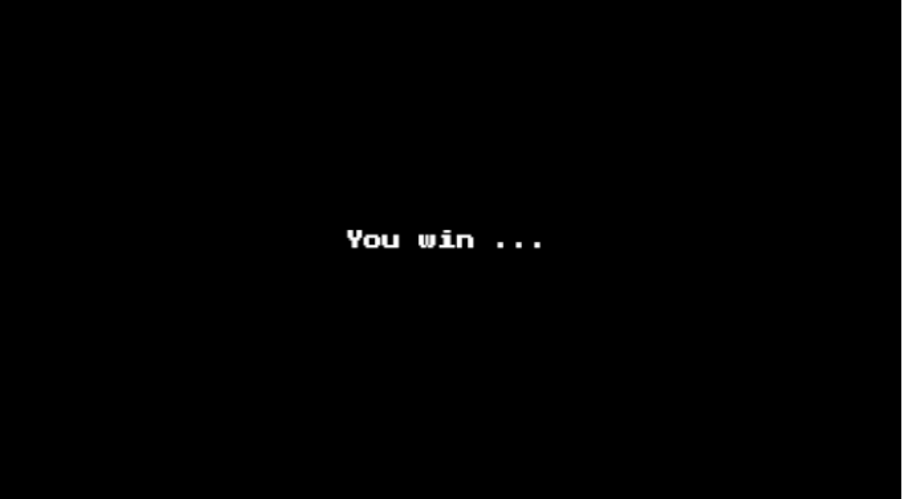

# Projecto "Unity Space Ship"

Implementación de un videjuego en Unity con tematica de naves espaciales.

## Integrantes
- Julian Chile Nina
- Jeampier Moran Fuño
- Edsel Alvan Ventura
- Alex Olaechea Carlo

## Niveles
A continuación se presentan los niveles creados en el juego.
### Pantalla de Inicio

### Nivel 1

### Nivel 2

### Nivel 3

### Nivel 4

### Nivel 5

## Pantalla Final

Videoclip del videojuego [aqui](https://drive.google.com/file/d/1pXJgq2AocCwSGA15y9BYvG6hGrQphh0e/view?usp=sharing) 